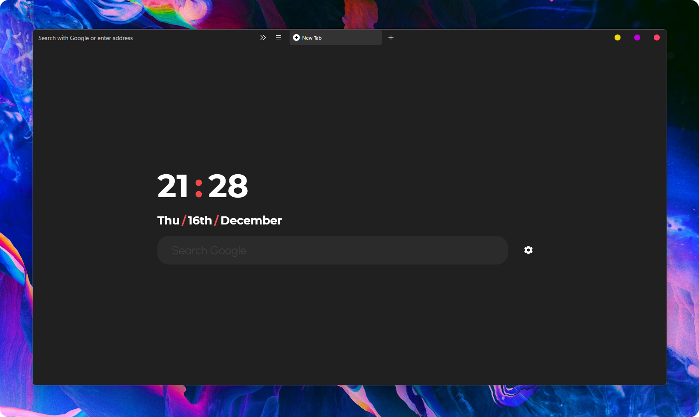

# Neatly

## 📃 Description

Neatly is a one line Firefox theme based on [Waterfall](https://github.com/crambaud/waterfall). This theme was made to complement [BIB3](https://www.deviantart.com/niivu/art/BIB3-for-Windows-886441919) Windows theme by [niivu](https://www.deviantart.com/niivu).

## ⭐ Features & Changes

- Autohide bookmarks toolbar
- Colored bookmarks icon
- Rounded UI elements
- Adjusted some UI alignment (button, url bar, etc.)

## ⚙️ Installation

- In the `about:config` page on your Firefox browser, set the following parameters to **True** :
  - `toolkit.legacyUserProfileCustomizations.stylesheets`
  - `layers.acceleration.force-enabled`
  - `gfx.webrender.all`
  - `svg.context-properties.content.enabled`
- Copy the userChrome.css file from this repository to your **chrome** folder. You can find the **chrome** folder here :
  - On Linux : `$HOME/.mozilla/firefox/######.default-release/chrome/`
  - On Windows : `C:\Users\[USERNAME]\AppData\Roaming\Mozilla\Firefox\Profiles\######.default-release\chrome\`
  - On MacOS : `Users/[USERNAME]/Library/Application Support/Firefox/Profiles/######.default-release/chrome`
  - If it doesn't exist already create a folder called chrome

## ⚠️ Note

- Not tested on Mac
- Feel free to customize but my apologies for cluttered codes.

## 🗒️ Credits

- Andreas Grafen (original cascade theme) (https://andreas.grafen.info)
- Clément Rambaud (mods on the original file for a mouse-centered use)
- niivu (the inspiration to make this theme)
- Paranoid Android (wallpaper)
- [nightTab](https://github.com/zombieFox/nightTab) (new tab page)
